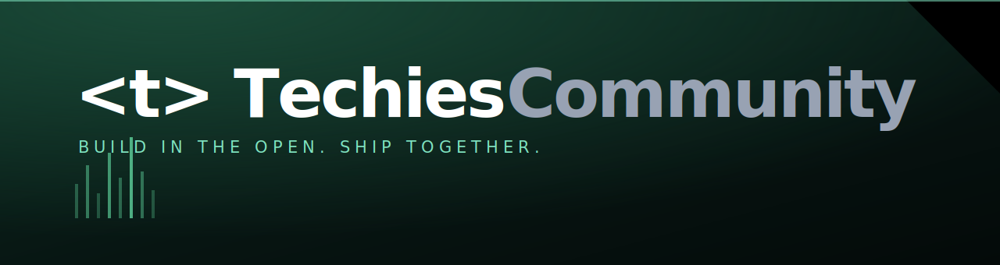

<div align="center">



# Techies Community

**Build in the open. Ship together.**

Landing page for an engineering collective — scroll-driven layout, a live
credential builder, and an assistant that answers from a real retrieval index.


[Quick start](#quick-start) · [How the chat works](#how-the-chat-works) · [Architecture](#architecture) · [Known gaps](#known-gaps)

</div>

---

## About the project

A single-page site for Techies Community, an engineering collective for people
who already build things. The brief was a dark, motion-heavy page that still
holds up on a phone — so every scroll effect has a non-jacking fallback, and
nothing above the fold waits on a video.

| Section | What it does |
| --- | --- |
| **Hero** | Full-bleed HLS video with the headline pinned to the bottom of the viewport |
| **Why** | Four panels that stack on scroll, each collapsing into a labelled tab |
| **Showcase** | Asymmetric card grid with a working tab filter |
| **Build** | Heading and intro stay pinned while a card rail pans horizontally |
| **TechPass** | Live credential builder — renders entirely client side as you type |
| **FAQ** | Accordion with animated height |
| **Footer** | Link columns and an infinite marquee wordmark |
| **Chat** | Floating assistant, RAG over a local knowledge base |

---

## Quick start

```bash
git clone https://github.com/Arishsingh/Tech-community.git
cd Tech-community
npm install
cp .env.example .env.local     # paste your Gemini key in
npm run dev
```

Open <http://localhost:3000>.

### Environment

| Variable | Required | Notes |
| --- | --- | --- |
| `GEMINI_API_KEY` | for the chat widget | Get one at [aistudio.google.com/apikey](https://aistudio.google.com/apikey) |
| `GEMINI_MODEL` | no | Defaults to `gemini-2.5-flash` |

The key is read only inside the route handler, so it never reaches the browser.
**Do not** prefix it with `NEXT_PUBLIC_`.

Everything except the chat widget runs without a key — the widget returns a 500
and shows an error in the panel.

---

## How the chat works

`src/lib/knowledge.ts` holds the corpus as short, single-topic chunks.

1. On the first request the route embeds every chunk with
   `gemini-embedding-001` and keeps the vectors in module memory for the life
   of the process.
2. Each question is embedded as a `RETRIEVAL_QUERY` and ranked against the
   corpus by cosine similarity.
3. Only the **top 4** chunks are passed to the model as context.

If the embedding call fails, ranking falls back to word overlap — the assistant
degrades instead of breaking.

The system prompt confines answers to the retrieved context, so questions the
corpus does not cover get a "no detail on that" rather than an invention:

```
Q: How much does it cost and do I need a degree?
A: Core membership is free. You do not need a degree to join.

Q: What is the CEO salary and your Berlin office address?
A: I do not have details about a CEO's salary or an office address in
   Berlin. You can find more information through the community hub.
```

To change what the bot knows, edit `src/lib/knowledge.ts` and restart. There is
no vector database and no index build step.

---

## Architecture

```
src/
├── app/
│   ├── api/chat/route.ts    retrieval + generation
│   ├── globals.css          design tokens, section styles, responsive rules
│   ├── layout.tsx           fonts, preconnects
│   └── page.tsx             section order
├── components/              one file per section
├── lib/
│   ├── fonts.ts             next/font setup
│   └── knowledge.ts         chat corpus
└── assets/                  generated card art
```

Section styles live in `globals.css` rather than utility classes — the sticky
and pinned layouts need real cascade. Offsets run through `--nav-h` and
`--stack-step`, so nav height and stacking rhythm shrink together at each
breakpoint instead of drifting apart.

### Motion and accessibility

- Scroll-jacking is disabled under `prefers-reduced-motion` **and** under 640px,
  where the pinned rail becomes a native swipeable list
- Hover-only transforms are suppressed on coarse pointers
- Full-height sections use `dvh`, so mobile browser chrome collapsing mid-scroll
  does not resize a pinned element
- Accordion panels use `visibility`, not `display`, to stay animatable while
  still leaving the accessibility tree

### Performance

- **No video fetches on load.** Panel and showcase clips attach their `src` only
  within 300px of the viewport; `hls.js` is deferred to `requestIdleCallback`
- **AVIF with blur placeholders** — card art drops from ~85KB PNG to about 1KB
  over the wire
- Preconnects to both media hosts save a DNS + TLS round trip

---

## Known gaps

Worth reading before you clone this expecting a finished product.

- Images in `src/assets` are **procedurally generated placeholders**, not brand
  artwork. Same for the logo.
- The QR block on the TechPass card is **decorative** — a deterministic pattern
  hashed from the form values, not a scannable code.
- TechPass export covers Print/PDF and copy-to-clipboard. PNG export needs a DOM
  rasteriser and is not wired up.
- **`/api/chat` has no rate limiting.** Add one before this goes on a public
  domain, or anyone who finds the endpoint can spend your Gemini quota.
- Media URLs for the hero stream and panel clips are hardcoded in the
  components — move them to env vars if they need to vary per environment.

---

## Scripts

| Command | Does |
| --- | --- |
| `npm run dev` | Dev server |
| `npm run build` | Production build |
| `npm run start` | Serve the build |
| `npm run lint` | ESLint |
